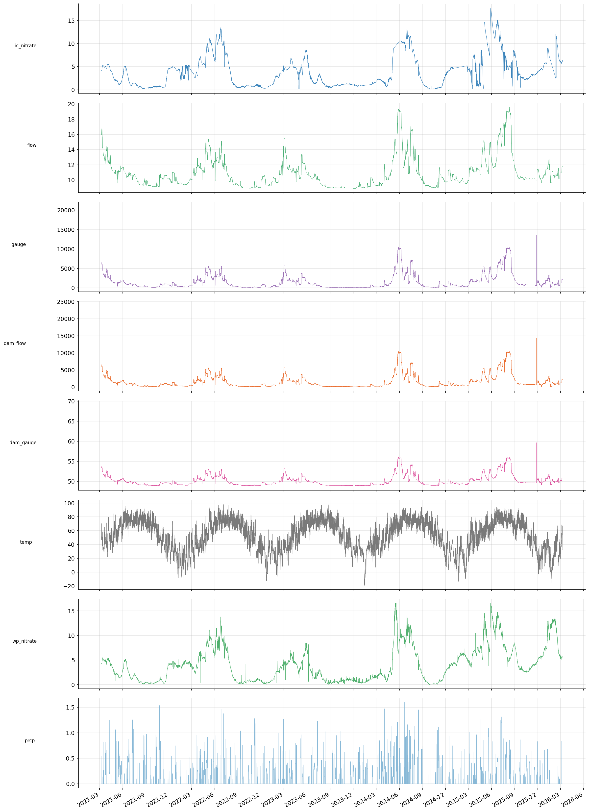
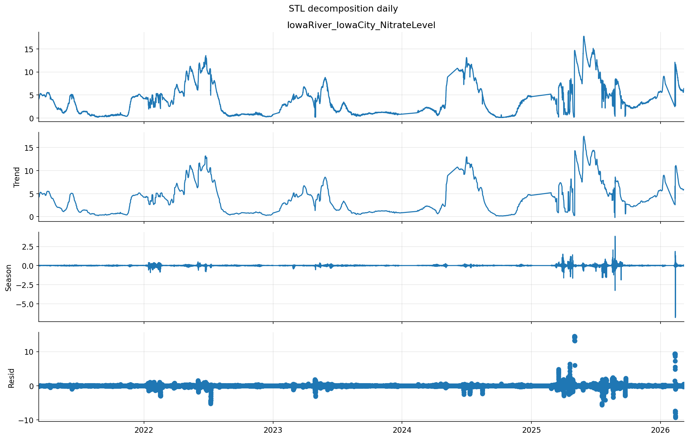
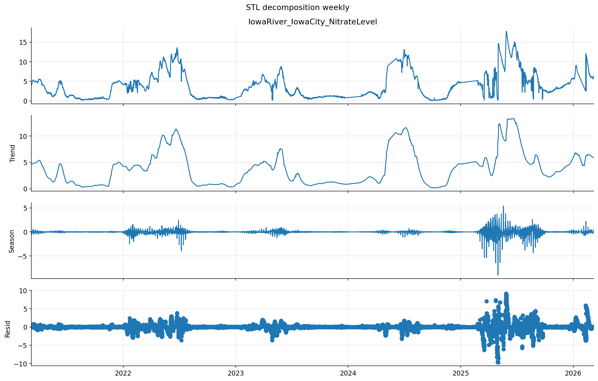
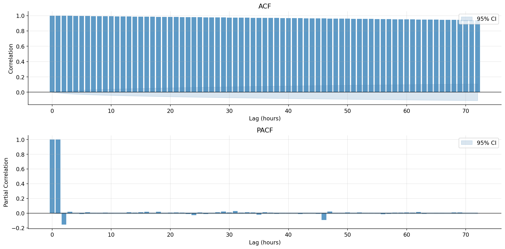
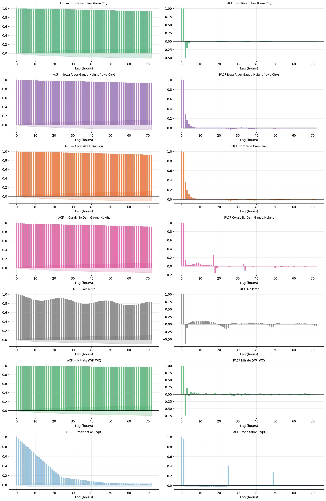
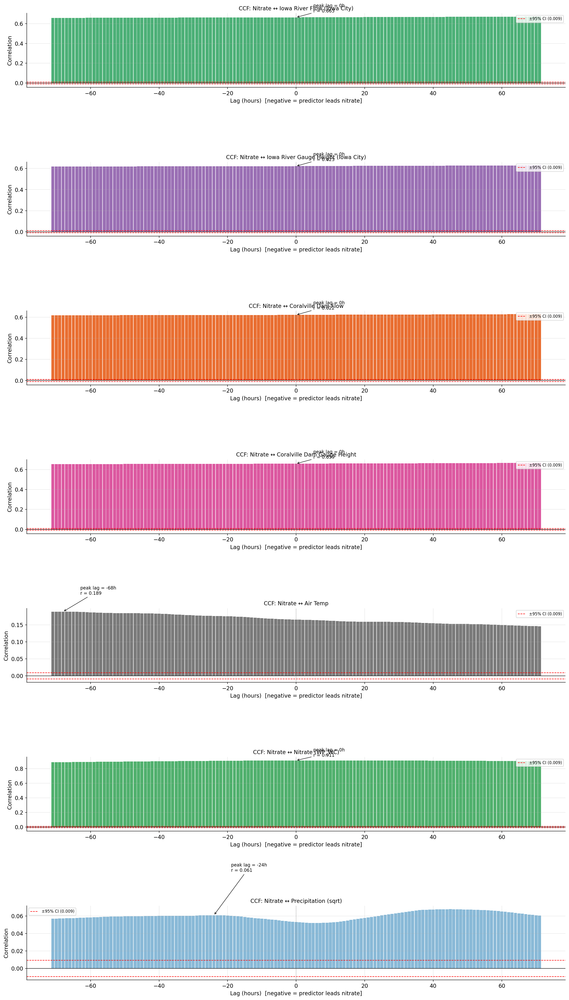
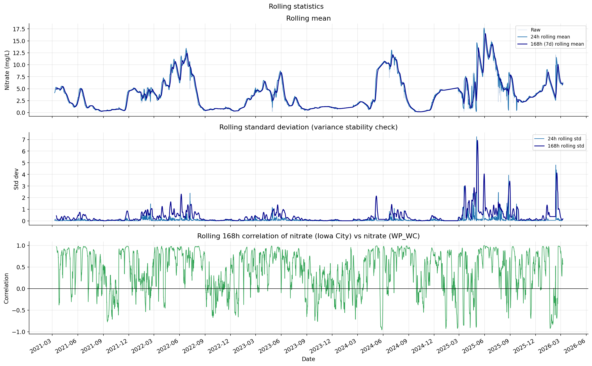
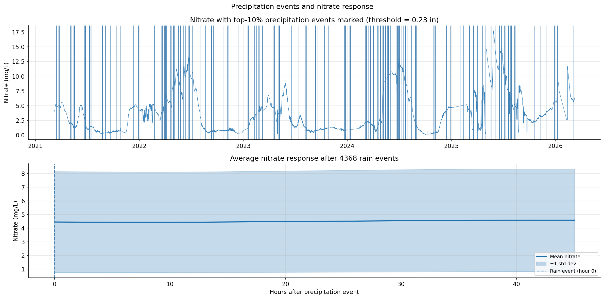

# Nitrate Forecasting
**Data period:** March 2021 – March 2026 

**Time step:** Hourly

**Total observations:** 43,819

---

## Time Series Overview
 

 
### What it shows
Full 5-year time series of all variables plotted on a shared time axis.
 
### Interpretation
The nitrate target exhibits large, slow-moving waves, elevated in spring and fall, depressed in summer. The most notable feature is increased volatility from 2025 onward, with larger and more frequent spikes than in 2021–2024. Flow and gauge height variables track closely with each other and show similar seasonal structure to nitrate, consistent with the physical expectation that high-flow events mobilize nitrate from agricultural soils. Precipitation is sparse and episodic as expected. The upstream nitrate sensor (`WP_WC_Nitrate_River`) closely mirrors the Iowa City target in its overall shape but with slightly smoother behavior.

---

## Data quality decisions made prior to EDA

- Coralville Reservoir USACE Level, Outflow, and Inflow variables were excluded due to >85% missingness
- Airport weather variables (relative humidity, precipitation) were excluded due to >85% missingness and from an unreliable source. Replaced with outside source of precipitation data.
- `WCP_00_TT_091` was missing 24 observations that were then forward filled. 
- Precipitation was square-root transformed (`PRCP_sqrt`) to reduce extreme skewness prior to correlation analysis
- All column name whitespace was stripped before analysis
- `WC_WP_Nitrate_River` was missing 7 observations and they were forward filled.
- `PRCP` was forward-filled with the same value per hour (one daily measurement) to convert it into hourly from daily. This doesn't change the structure of the data itself.  

---

## Distributions and Outlier Inspection

**Nitrate variables:** Right-skewed with a long upper tail reaching 17.74 mg/L. The majority of hours fall below 6 mg/L, but spikes well above this threshold are the primary forecasting challenge. The distribution is not normal.

**Gauge height variables:** Extremely right-skewed with outliers up to ~21,000 units. The median is ~800 but the 95th percentile is ~5,600. These outliers must correspond to flood events. They should be preserved in the dataset but may need a log transform when used as a model feature to prevent them from dominating regression coefficients.

**Precipitation:** 74% of hourly values are zero (no rain). Non-zero values are heavily right-skewed. The square-root transform substantially compresses the tail and is applied for all subsequent analysis as `PRCP_sqrt`.

**Flow variables:** Moderately right-skewed with values concentrated in a lower range but with a meaningful upper tail corresponding to high-flow events.

**WCP_00_TT_091:** Broadly distributed with a roughly symmetric shape.

---

## STL Decomposition

### What it shows
Seasonal-Trend decomposition using LOESS (STL), separating the nitrate time series into trend, seasonal, and residual components at both 24-hour (daily) and 168-hour (weekly) periods.

### Interpretation

**Trend:** Nitrate follows multi-week to multi-month cycles, only rising during spring snowmelt and fall rainfall seasons, dropping in summer. The trend is slow-moving and persistent, consistent with the near-unit-root behavior seen in the ACF.

**Seasonality:** Weak for both daily and weekly periods across most of the 2021–2024 record. The seasonal component is near zero for extended stretches, indicating that nitrate does not follow a consistent daily or weekly rhythm. Seasonal spikes appear only episodically, concentrated around high-flow events.

**Residuals:** Well-behaved (small, near-zero) through most of 2021–2024, then becoming large and erratic from mid-2025 onward. This is the clearest evidence of a change of some sort in the latter portion of the dataset. This period requires careful attention during model validation.

**Comparison — WP_WC nitrates vs. Iowa City nitrate STL:**
The upstream sensor (`WP_WC_Nitrate_River`) produces a cleaner STL decomposition (smoother trend, smaller seasonal spikes, and residuals confined to ±3 mg/L versus ±10 mg/L for the Iowa City target). Need to ask client which target we should use.

---

## ACF and PACF (Nitrate Target)

### What it shows
Autocorrelation function (ACF) and partial autocorrelation function (PACF) for the Iowa City nitrate target up to 72-hour lags.

### Interpretation

**ACF:** Decays extremely slowly, remaining above 0.8 at lag 72. This is a highly persistent, non-stationary series. The series has a near-unit root meaning nitrate levels today are strongly predictive of nitrate levels three days from now. First differencing (d=1) will be required before fitting a model.

**PACF:** Shows two large spikes at lags 1 and 2, then drops sharply to near zero and remains there for all subsequent lags. This is an AR(2) pattern. Once you account for the previous two hours of nitrate, no further autoregressive terms add meaningful explanatory power within the 72-hour window.

**SARIMAX non-seasonal order implied:** p=2, d=1, q=0 as a starting point.

**Ljung-Box test:** Significant autocorrelation confirmed at all tested lags (6, 12, 24, 48, 72 hours), validating that autoregressive modeling is appropriate and necessary.

---

## ACF and PACF (All Predictors)

### What it shows
ACF and PACF plots for each predictor variable, informing how they should be preprocessed before inclusion in model.

### Interpretation

**Flow and gauge height variables:** ACFs near 1.0 across all lags, PACFs with a single dominant spike at lag 1 then near-zero thereafter. These are AR(1) processes. Including raw values as regressors risks multicollinearity across time. Maybe use first differences or rolling means to de-persist them before inclusion.

**WCP_00_TT_091:** Exhibits a sinusoidal ACF pattern oscillating between approximately 0.8 and 0.9 with a 24-hour period. This is a diurnal cycle. The PACF shows a strong spike at lag 1, large negative at lag 2. This variable's lagged values at multiples of 24 hours may be useful features.

**Upstream nitrate (`WP_WC`):** ACF and PACF nearly identical to the Iowa City target. Strong AR(2) structure.

**Precipitation (sqrt):** ACF decays gradually reaching near zero around lag 50. The PACF shows a meaningful spike at lag 24 beyond the dominant lag-1 spike, suggesting a 24-hour autocorrelation in precipitation independent of lag 1. Precipitation is the only variable with meaningful decay in its ACF, making it the most statistically independent predictor in the feature set.

---

## Cross-Correlation Functions (CCF)

### What it shows
Cross-correlation between the nitrate target and each predictor at lags from -72 to +72 hours. Negative lags indicate the predictor leads nitrate (the more useful direction for forecasting).

### Interpretation

**Iowa River flow and gauge height (both locations):** Uniformly high CCF (~0.60–0.65) across the entire ±72 hour window with almost no variation by lag. The correlation is essentially the same whether these variables lead or lag nitrate by up to 3 days. This indicates flow and nitrate move together as part of the same system rather than flow driving nitrate. Include as concurrent (lag 0) predictors.

**WCP_00_TT_091:** Weaker CCF (~0.15–0.19) but statistically significant throughout the negative lag range. Peak correlation at approximately lag -68 hours (predictor leads nitrate by 68 hours). This is the only variable showing a meaningful leading relationship at a multi-day horizon. Include at lag 48–72 hours as a longer-range leading feature.

**Precipitation (sqrt):** Very weak CCF throughout (peak r ≈ 0.061 at lag -24 hours), barely clearing the 95% confidence interval. The signal exists but is weak at hourly time steps. Cumulative rolling precipitation features are expected to show stronger signal than the raw hourly value.

---

## Rolling Statistics

### What it shows
24-hour and 168-hour rolling mean and standard deviation of the nitrate target, plus rolling correlation between the two nitrate sensors.

### Interpretation

**Rolling mean:** The 24-hour and 168-hour rolling means are nearly identical throughout most of the record, confirming that day-to-day noise in nitrate is minimal relative to the dominant multi-week trend. The series is driven by slow cycles, not rapid hourly changes.

**Rolling standard deviation:** Near zero and stable from 2021 through mid-2024. Then spikes dramatically and repeatedly from 2025 onward, with the 168-hour standard deviation reaching values 5–7 times the pre-2025 baseline. This is strong evidence of non-constant variance which violates a core assumption of standard SARIMAX. Options for addressing this include log-transforming the target variable or using Box-Cox transform.

**Rolling correlation between sensors:** Oscillates between -1.0 and +1.0 throughout the entire 5-year record with no stable pattern. This is unexpected for two sensors measuring the same river system and shows that at some flow levels one sensor leads the other and at others the relationship reverses.

---

## Precipitation Event Analysis

### What it shows
Nitrate time series with top-10% precipitation events marked, and the average nitrate trajectory in the 72 hours following rain events.

### Interpretation

**Event marking (top plot):** Rain events (≥0.23 inches/day, top 10% threshold) are frequent and broadly distributed throughout the record. There is no obvious visual pattern of nitrate spiking immediately after rain events at the full-series scale.

**Average response (bottom plot):** The mean nitrate across the 72 hours following 4,368 identified rain events is essentially flat at ~4.5 mg/L with no directional movement. The wide standard deviation band (±~3.5 mg/L) reflects high variability in how nitrate responds to rain across different seasons and baseline conditions.

**Conclusion:** Precipitation does not produce a consistent, detectable nitrate response within 72 hours at this location and time step. The effect is likely mediated by season, flow conditions, and soil moisture. This does not mean precipitation is uninformative, but rather that its effect is non-linear and context-dependent. Cumulative precipitation indices and interaction terms with flow state will likely be more informative than raw hourly precipitation values.

---

## Recommended Feature Engineering

The following features are recommended for the SARIMAX baseline model based on EDA findings:

**Autoregressive features (from PACF)**
- `nitrate_lag_1` (IC nitrates) 
- `nitrate_lag_2`

**Water features (from CCF)**
- `flow_iowa_city_lag_0` 
- `gauge_iowa_city_lag_0`
- `dam_flow_lag_0`
- `dam_gauge_lag_0`
- `diff_flow_lag_1` — first difference of flow (Either location or both)

**WC_WP nitrate (from CCF)**
- (Only if it makes sense to include the other nitrate sensor as a predictor)
- `wc_wp_nitrate_lag_1` 
- `wc_wp_nitrate_lag_2` 

**WCP_TT variable (from CCF)**
- `wcp_lag_48` 
- `wcp_lag_72`

**Precipitation features (from CCF and event analysis)**
- `PRCP_sqrt_lag_24` — sqrt precipitation at lag 24 hours
- `PRCP_rolling_sum_24h` — cumulative precipitation over past 24 hours
- `PRCP_rolling_sum_48h` — cumulative precipitation over past 48 hours
- `PRCP_rolling_sum_72h` — cumulative precipitation over past 72 hours

---

